# Status

## 10-29
- improvements to UI for homepage
- working on persist image to object store with UID 
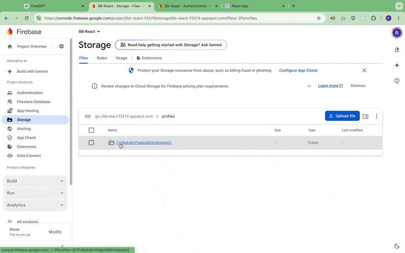

## 10-28
- swipe capability and persist to DB 

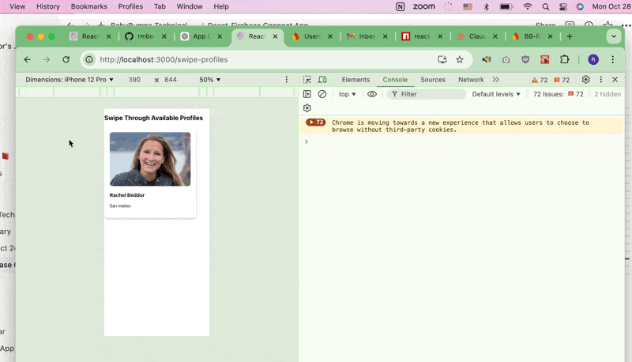
- records in FireStore DB as {swiper Name, swiper ID, profile ID, profile Name, swipe direction, timestamp}
- it's probably inefficient to do display names but can help at this early stage
- files involved with this: 
- - swipeableCard - gui component to display a card and permit users to swipe left/right
- - swipeableList - handles a list of swipeableCards
- - profileTinderList - pulls the profiles from firestore and displays in a swipeableList, with each profile getting a swiepableCard
- - service/swipeService.js - handles persisting the swipe info to the firestore database 

## 10-25
- made it faster and identified the cause of the 'loading" screen
- made the main page more professional looking (code base is not professional though ) but took so long

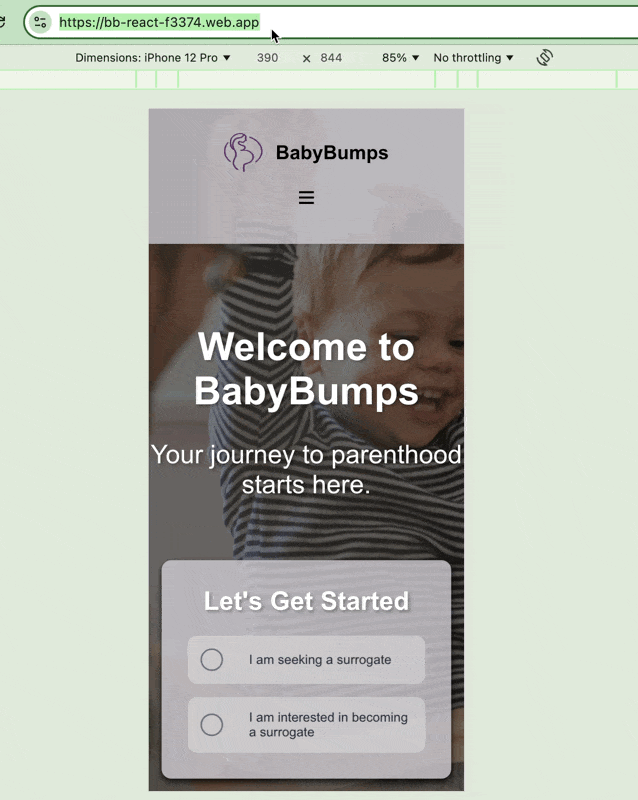

- worked on a new main page mainpage2 but accidentally edited a little bit of mainpage.css 
ToDo: 
- need to get mainpage.css consolidated. 

## 10-24-2024
- learned some ways to measure performance (use profiler from react or just the recorder and performance panel) , but did not learn how to identify what exactly is causing the slowness. After implementing lazy loading and removing the query of profiles from app.js the latency appears to be improving . 
- - continuing to try to adjust that pic of the dads, but i feel like maybe the pic isn't the prob . still good to try for learning. 
- made it look a lot better 
- slowness - still trying to figure out why 
- see how the image isn't immediate 
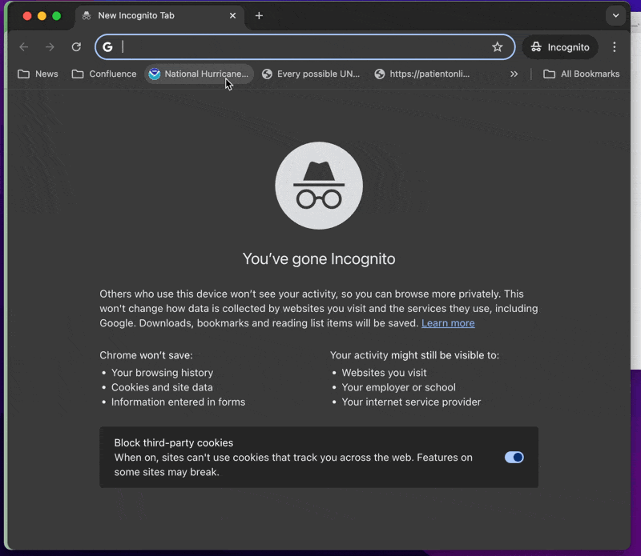

- otherwise here's a tour - really happy with the style 

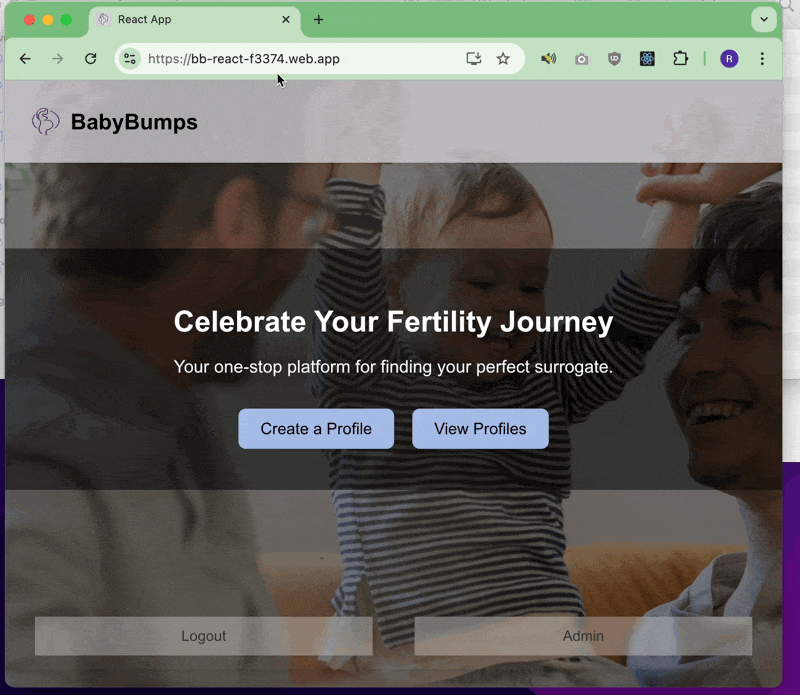

- here's a mobile screenshot 

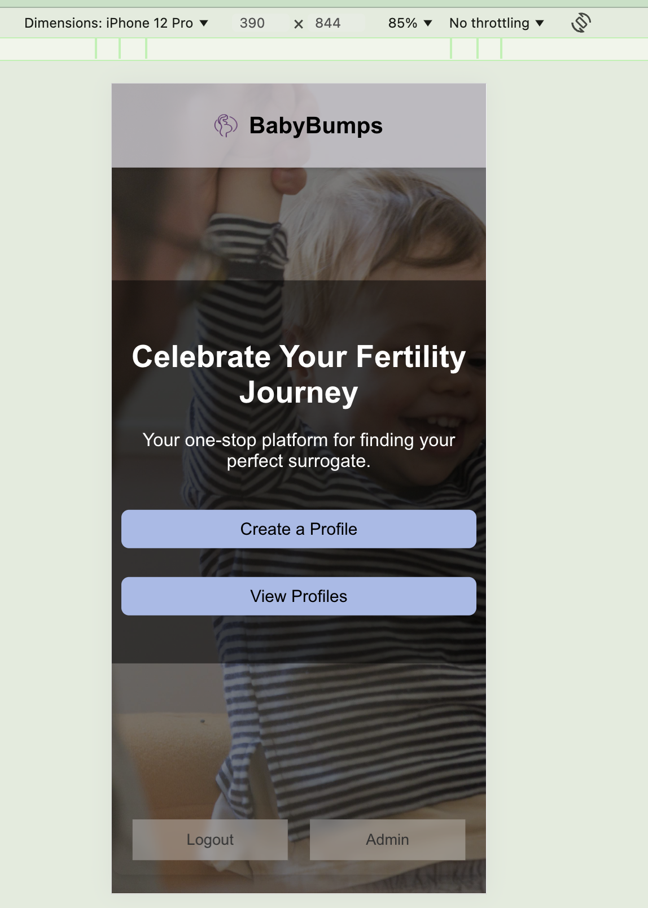

- changed the way to do secrets from `.env` to a bash script to add secrets to gh using the gh cli
- then call the gh secrets by persisting them to env variables as part of deployment process (change to yaml)
- this way when rotate keys you can just change `add_secrets.sh`
- no `add_secrets.sh` in the gh repo because added to `.gitignore`
- put the secrets into a `.env.local` so i can also still use `npm start` locally to debug before pushing to deployment 
- fixed the back button

### React Diagram Example

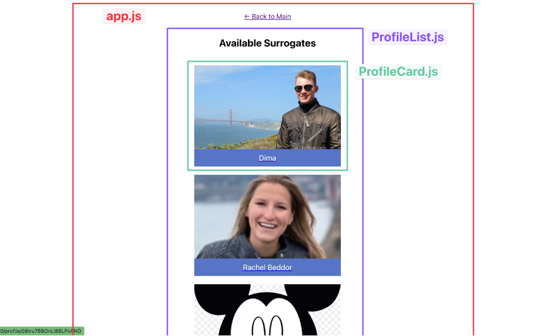

## 10-23-2024

- moved the keys to `.env` file and added to `.gitignore` to hide the keys from github entirely
- called `.env` in `firebase-config.js` instead of calling keys directly
- this is a step in the right direction for a prod deployment , though probably could still be configured more elegantly 

## 10-22-2024

- Connected Firebase 
- Correctly hosted 
- made admin screen
- you can see from the gif that it does need some work on reactivity
- fixed the workflow (github actions) (the .github/yaml files)so that the push causes firebase deploy pipeline

https://bb-react-f3374.web.app/

### login with google demo
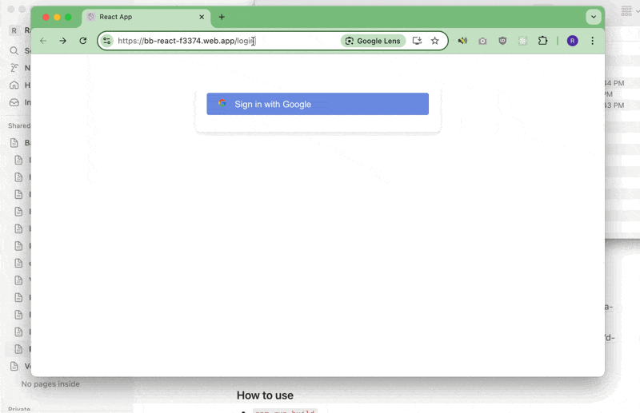

### admin screen demo
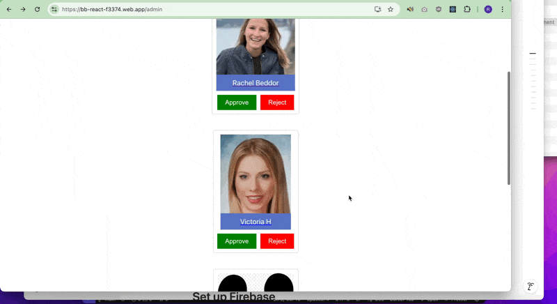

# The below statuses are actually from the react tutorial project
## 10-21-2024
- continuing to build skeleton but will start making legit with firebase shortly 
- the create profile form is just a skeleton. it doesn't submit anything for real because we need to move that to a firestore call eventually
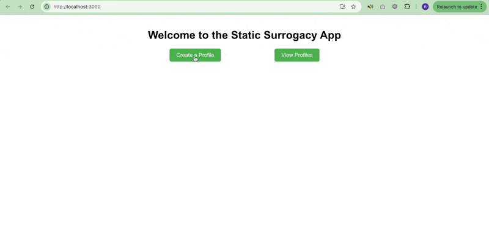

## 10-18-2024
- building a skeleton (using AI but making it as basic as possible) - static app (this was recommended from the tutorial)
- should help us get our ducks in a row and build from there
- will also help me become familiar with the syntax and best practices 
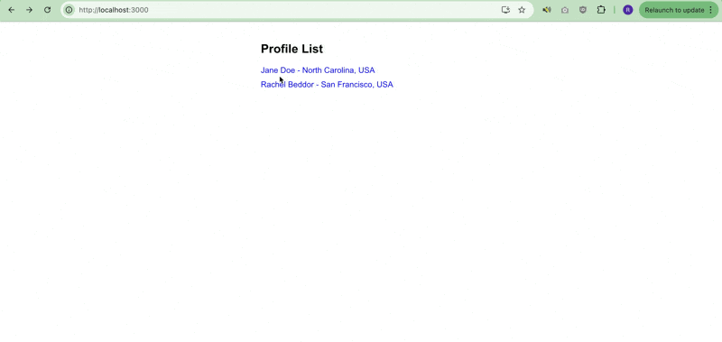

# Getting Started with Create React App

This project was bootstrapped with [Create React App](https://github.com/facebook/create-react-app).

## Available Scripts

In the project directory, you can run:

### `npm start`

Runs the app in the development mode.\
Open [http://localhost:3000](http://localhost:3000) to view it in your browser.

The page will reload when you make changes.\
You may also see any lint errors in the console.

### `npm test`

Launches the test runner in the interactive watch mode.\
See the section about [running tests](https://facebook.github.io/create-react-app/docs/running-tests) for more information.

### `npm run build`

Builds the app for production to the `build` folder.\
It correctly bundles React in production mode and optimizes the build for the best performance.

The build is minified and the filenames include the hashes.\
Your app is ready to be deployed!

See the section about [deployment](https://facebook.github.io/create-react-app/docs/deployment) for more information.

### `npm run eject`

**Note: this is a one-way operation. Once you `eject`, you can't go back!**

If you aren't satisfied with the build tool and configuration choices, you can `eject` at any time. This command will remove the single build dependency from your project.

Instead, it will copy all the configuration files and the transitive dependencies (webpack, Babel, ESLint, etc) right into your project so you have full control over them. All of the commands except `eject` will still work, but they will point to the copied scripts so you can tweak them. At this point you're on your own.

You don't have to ever use `eject`. The curated feature set is suitable for small and middle deployments, and you shouldn't feel obligated to use this feature. However we understand that this tool wouldn't be useful if you couldn't customize it when you are ready for it.

## Learn More

You can learn more in the [Create React App documentation](https://facebook.github.io/create-react-app/docs/getting-started).

To learn React, check out the [React documentation](https://reactjs.org/).

### Code Splitting

This section has moved here: [https://facebook.github.io/create-react-app/docs/code-splitting](https://facebook.github.io/create-react-app/docs/code-splitting)

### Analyzing the Bundle Size

This section has moved here: [https://facebook.github.io/create-react-app/docs/analyzing-the-bundle-size](https://facebook.github.io/create-react-app/docs/analyzing-the-bundle-size)

### Making a Progressive Web App

This section has moved here: [https://facebook.github.io/create-react-app/docs/making-a-progressive-web-app](https://facebook.github.io/create-react-app/docs/making-a-progressive-web-app)

### Advanced Configuration

This section has moved here: [https://facebook.github.io/create-react-app/docs/advanced-configuration](https://facebook.github.io/create-react-app/docs/advanced-configuration)

### Deployment

This section has moved here: [https://facebook.github.io/create-react-app/docs/deployment](https://facebook.github.io/create-react-app/docs/deployment)

### `npm run build` fails to minify

This section has moved here: [https://facebook.github.io/create-react-app/docs/troubleshooting#npm-run-build-fails-to-minify](https://facebook.github.io/create-react-app/docs/troubleshooting#npm-run-build-fails-to-minify)
