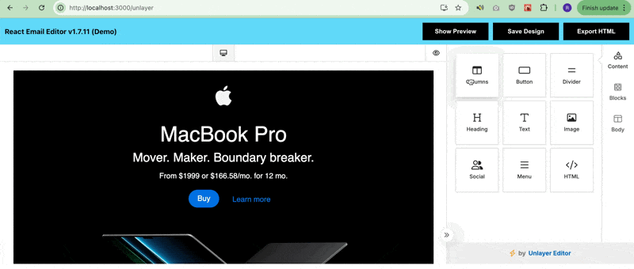
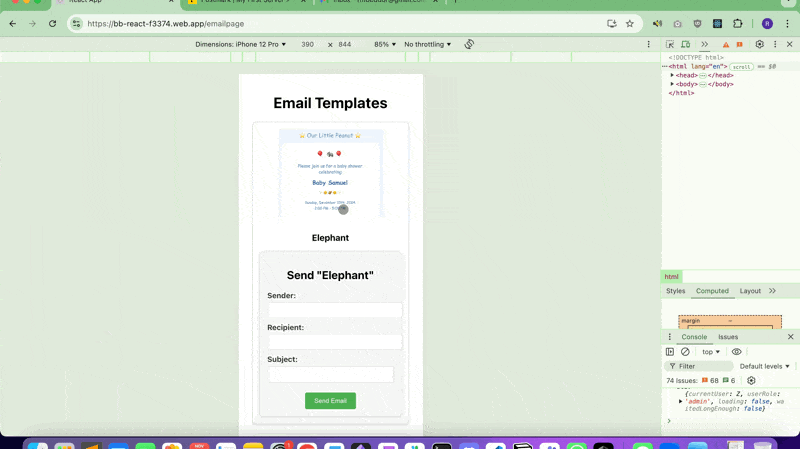
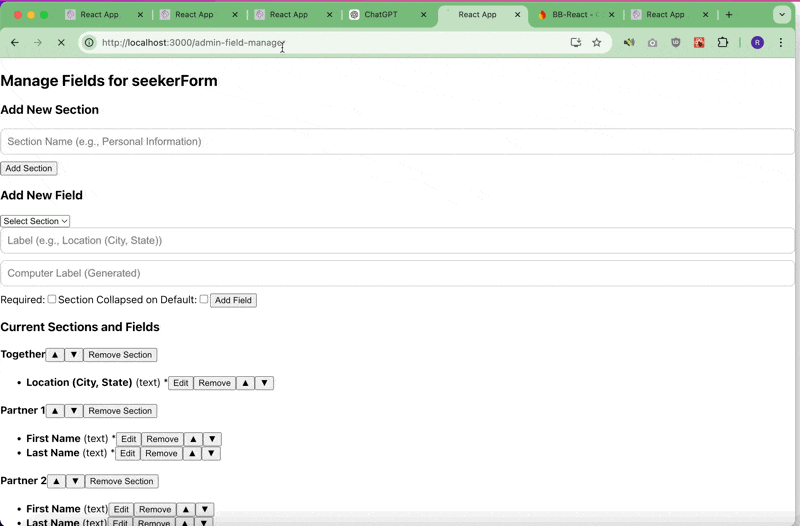
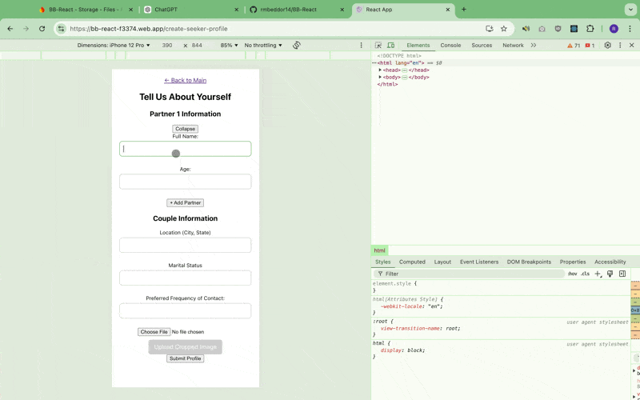

# Status

## 01-08 Update to Open Source 
- cleaning this up so we can use the live link in applications
- this was a demo of swiping that we used to learn firebase and get an idea for how we might want the tech to look
- our company will encompass much more than swiping now 
### things I changed for the demo 
- adjusted firestore security rules so that the fake "profiles" database can be read by the app & users can read their own data (for RBAC)
- remove log-in requirement for profiles swipe demo (though still included in the demo for github)
- firestore rules 

```
rules_version = '2';

service cloud.firestore {
  match /databases/{database}/documents {
    
    // Public read access to the 'profiles' collection
    match /profiles/{document=**} {
      allow read: if true; // Allows anyone to read the profiles
    }
    
    // Allow authenticated users to read their own document in the 'users' collection
    match /users/{userId} {
      allow read: if request.auth != null && request.auth.uid == userId;
    }

    // Allow authenticated users to write to the 'swipes' collection
    match /swipes/{document=**} {
      allow write: if request.auth != null; // Only authenticated users can write
    }

    // Deny all other access by default
    match /{document=**} {
      allow read, write: if false;
    }
  }
}
```

## 11-7 
- try out unlayer
- there's an open source email lib from unlayer that works really well it seems? idk. I think we could use it to make this happen 


## 11-5 
- set up proxy layer for apis thru firebase fxn , which is cleaner method than firebase fxn for each thing but still allows api key security
- it is somewhat complicated to set up firebase fxn because need it to work for both local env and hosted env
- try require auth token from firebase because overrode some CORS policy to use both local dev and hosted dev together
- this is for email thing but also for all apis in future potentially 
- eventually picked the following: 
    - **postmark** for email sending
    - **firebase proxy function** for hiding the api key and managing requests

- in future workflow for new designs could be like figma-> html export -> postmark -> site 



## 11-4
- set up private auth to wrap and only allow admin via a RBAC firestore call 
- Victoria & Rachel are admins
- some bugs in this too, check privateroute.js , had to do a timeout bc firestore call is asynchronous , this is a bad method. need to change later
- after that i explored the email software but did not git push because there's an issue here with how i did the firebase functions
- i hate firebase fxns, did all this frontend auth but the backend wasn't even authed at all. also it's super hard to rapid prototype them. i'm just gonna api call frontend and keep the api key in an env variable unless there's some major issue with that. will work on that tomorrow will need to roll back stuff. 

## 10-30
- admin dynamic form building functionality first steps - you can check it out at `/admin-field-manager` and `/dynamic-form`

- not connected to the rest of the app yet so all the gui components for profile form and profile viewing pull from the hard code not the dynamic admin created fields. that is next 




- dynamic fields was tricky, tried to minimize structure but do need some structure in the firebase . decided on

- `formFields/{formID}/versions/{timestamp}` : keeps a record of everytime someone submits

- `formFields/{formID}/latest/latest` : stores the latest 

- persisting twice is better than constantly querying the versions IMO

- formID is like “seekerForm” or “surrogateForm” 

- the issue was also how to organize sections (because like you might want collapsable sections for like Partner 1 Partner 2) 

- haven’t implemented it so it writes to surrogate or seeker forms yet. will need to do that and then recreate everyon’e sprofile and make sure it works in the viewable gui components. 

- a lot of work but i think it will make the app 100x better because Victoria or the admin can directly edit the form. you won’t need to know jsx to make edits to the form.


## 10-29
- improvements to UI for homepage (slideshow to match e-harmony)
- working on persist image to object store with UID (eventually changed this to also have /timestamp so I can do multiple profiles (though that wouldn't be relevant IRL))
- made a seeker and a surrogate separate profile pages 
- need data stuff so eventually we need to have the data separate and probably even just an admin profile that changes the way the form is done so that the admin can decide how to do the forms. right now too hard code with persist and retrieval of data.

### demo of the latest (10/29/2024)
- create seeker profile with the new seeker form
- approve in admin portal
- swipe and see it 
- click on the card to see more profile data 



### persisting image data to cloud object storage


## 10-28
- swipe capability and persist to DB 


- records in FireStore DB as {swiper Name, swiper ID, profile ID, profile Name, swipe direction, timestamp}
- it's probably inefficient to do display names but can help at this early stage
- files involved with this: 
- - swipeableCard - gui component to display a card and permit users to swipe left/right
- - swipeableList - handles a list of swipeableCards
- - profileTinderList - pulls the profiles from firestore and displays in a swipeableList, with each profile getting a swiepableCard
- - service/swipeService.js - handles persisting the swipe info to the firestore database 


## 10-25
- made it faster and identified the cause of the 'loading" screen
- made the main page more professional looking (code base is not professional though ) but took so long


- worked on a new main page mainpage2 but accidentally edited a little bit of mainpage.css 
ToDo: 
- need to get mainpage.css consolidated. 

## 10-24-2024
- learned some ways to measure performance (use profiler from react or just the recorder and performance panel) , but did not learn how to identify what exactly is causing the slowness. After implementing lazy loading and removing the query of profiles from app.js the latency appears to be improving . 
- - continuing to try to adjust that pic of the dads, but i feel like maybe the pic isn't the prob . still good to try for learning. 
- made it look a lot better 
- slowness - still trying to figure out why 
- see how the image isn't immediate 


- otherwise here's a tour - really happy with the style 


- here's a mobile screenshot 


- changed the way to do secrets from `.env` to a bash script to add secrets to gh using the gh cli
- then call the gh secrets by persisting them to env variables as part of deployment process (change to yaml)
- this way when rotate keys you can just change `add_secrets.sh`
- no `add_secrets.sh` in the gh repo because added to `.gitignore`
- put the secrets into a `.env.local` so i can also still use `npm start` locally to debug before pushing to deployment 
- fixed the back button


### React Diagram Example


## 10-23-2024

- moved the keys to `.env` file and added to `.gitignore` to hide the keys from github entirely
- called `.env` in `firebase-config.js` instead of calling keys directly
- this is a step in the right direction for a prod deployment , though probably could still be configured more elegantly 

## 10-22-2024

- Connected Firebase 
- Correctly hosted 
- made admin screen
- you can see from the gif that it does need some work on reactivity
- fixed the workflow (github actions) (the .github/yaml files)so that the push causes firebase deploy pipeline

https://bb-react-f3374.web.app/

### login with google demo


### admin screen demo


# The below statuses are actually from the react tutorial project
## 10-21-2024
- continuing to build skeleton but will start making legit with firebase shortly 
- the create profile form is just a skeleton. it doesn't submit anything for real because we need to move that to a firestore call eventually


## 10-18-2024
- building a skeleton (using AI but making it as basic as possible) - static app (this was recommended from the tutorial)
- should help us get our ducks in a row and build from there
- will also help me become familiar with the syntax and best practices 


# Getting Started with Create React App

This project was bootstrapped with [Create React App](https://github.com/facebook/create-react-app).

## Available Scripts

In the project directory, you can run:

### `npm start`

Runs the app in the development mode.\
Open [http://localhost:3000](http://localhost:3000) to view it in your browser.

The page will reload when you make changes.\
You may also see any lint errors in the console.

### `npm test`

Launches the test runner in the interactive watch mode.\
See the section about [running tests](https://facebook.github.io/create-react-app/docs/running-tests) for more information.

### `npm run build`

Builds the app for production to the `build` folder.\
It correctly bundles React in production mode and optimizes the build for the best performance.

The build is minified and the filenames include the hashes.\
Your app is ready to be deployed!

See the section about [deployment](https://facebook.github.io/create-react-app/docs/deployment) for more information.

### `npm run eject`

**Note: this is a one-way operation. Once you `eject`, you can't go back!**

If you aren't satisfied with the build tool and configuration choices, you can `eject` at any time. This command will remove the single build dependency from your project.

Instead, it will copy all the configuration files and the transitive dependencies (webpack, Babel, ESLint, etc) right into your project so you have full control over them. All of the commands except `eject` will still work, but they will point to the copied scripts so you can tweak them. At this point you're on your own.

You don't have to ever use `eject`. The curated feature set is suitable for small and middle deployments, and you shouldn't feel obligated to use this feature. However we understand that this tool wouldn't be useful if you couldn't customize it when you are ready for it.

## Learn More

You can learn more in the [Create React App documentation](https://facebook.github.io/create-react-app/docs/getting-started).

To learn React, check out the [React documentation](https://reactjs.org/).

### Code Splitting

This section has moved here: [https://facebook.github.io/create-react-app/docs/code-splitting](https://facebook.github.io/create-react-app/docs/code-splitting)

### Analyzing the Bundle Size

This section has moved here: [https://facebook.github.io/create-react-app/docs/analyzing-the-bundle-size](https://facebook.github.io/create-react-app/docs/analyzing-the-bundle-size)

### Making a Progressive Web App

This section has moved here: [https://facebook.github.io/create-react-app/docs/making-a-progressive-web-app](https://facebook.github.io/create-react-app/docs/making-a-progressive-web-app)

### Advanced Configuration

This section has moved here: [https://facebook.github.io/create-react-app/docs/advanced-configuration](https://facebook.github.io/create-react-app/docs/advanced-configuration)

### Deployment

This section has moved here: [https://facebook.github.io/create-react-app/docs/deployment](https://facebook.github.io/create-react-app/docs/deployment)

### `npm run build` fails to minify

This section has moved here: [https://facebook.github.io/create-react-app/docs/troubleshooting#npm-run-build-fails-to-minify](https://facebook.github.io/create-react-app/docs/troubleshooting#npm-run-build-fails-to-minify)
